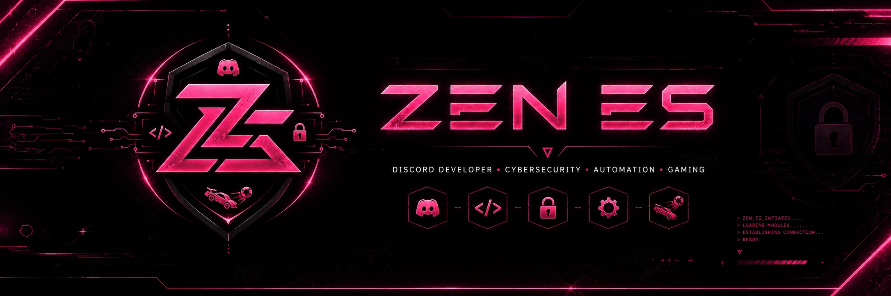
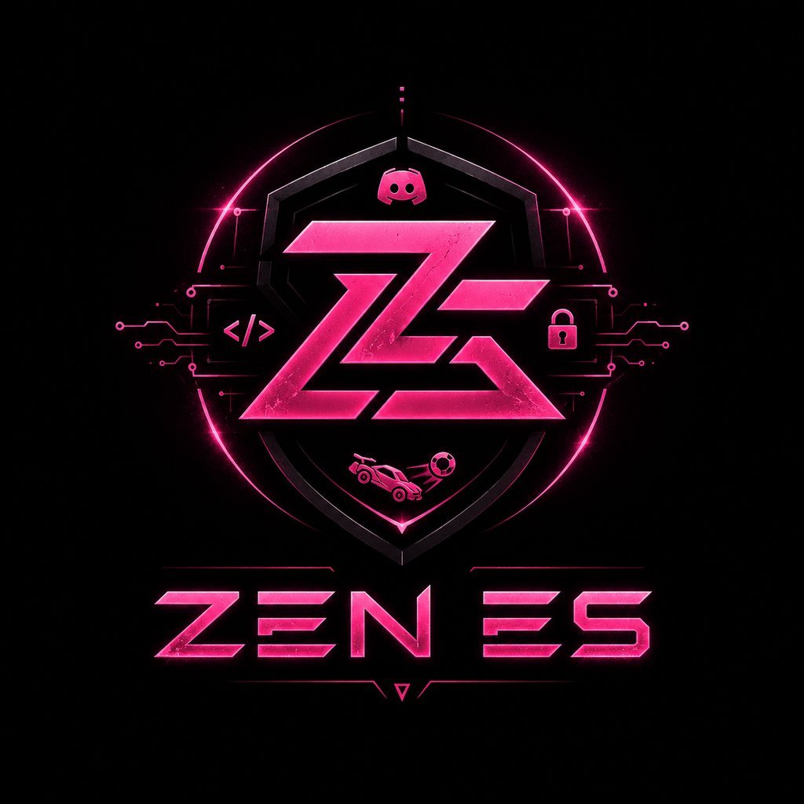

  

  

<h1 align="center">Hola, soy ZEN ES 👋</h1>
<h3 align="center">Discord Bot Developer · Cybersecurity · Automation · Utilities</h3>

  
  
  

---

## 👨‍💻 Sobre mí

Soy **ZEN ES**, desarrollador centrado en la creación de **bots, sistemas y herramientas para Discord**, junto con proyectos de automatización, utilidades y ciberseguridad.

Me gusta construir proyectos que no solo funcionen, sino que sean **útiles, rápidos, seguros, fáciles de configurar y visualmente cuidados**. Mi objetivo es crear soluciones completas capaces de mejorar la administración, protección y experiencia de cualquier comunidad.

- 🤖 Desarrollo bots completos y sistemas personalizados para Discord.
- 🛡️ Trabajo con AutoMod, antiraid, auditoría de permisos y protección de servidores.
- ⚙️ Creo automatizaciones, paneles, APIs, integraciones y herramientas de administración.
- 🧩 Diseño sistemas modulares, escalables y sencillos de mantener.
- 🚀 Desarrollo proyectos como **Luna, ModMail, Insticket** y muchas más herramientas.
- 📚 Siempre estoy aprendiendo, investigando y mejorando mis proyectos.

---

## 🚀 Proyectos principales

<table>
  <tr>
    <td width="50%" valign="top">
      <h3 align="center">🌙 Luna</h3>
      
<b>Bot todo en uno para Discord</b>

      
Moderación, AutoMod, seguridad, antiraid, tickets, registros, roles, sugerencias, sorteos, automatizaciones y muchas más utilidades.

      

    </td>
    <td width="50%" valign="top">
      <h3 align="center">📨 ModMail</h3>
      
<b>Soporte privado y organizado</b>

      
Sistema de contacto entre usuarios y equipos de soporte mediante mensajes privados, casos, registros, categorías y respuestas del equipo.

      

    </td>
  </tr>
  <tr>
    <td width="50%" valign="top">
      <h3 align="center">🎫 Insticket</h3>
      
<b>Tickets rápidos y personalizables</b>

      
Creación y gestión de tickets con formularios, departamentos, permisos, transcripciones, valoraciones y estadísticas del equipo.

      

    </td>
    <td width="50%" valign="top">
      <h3 align="center">🧪 Más proyectos</h3>
      
<b>Bots, módulos y herramientas</b>

      
También trabajo en utilidades, sistemas de seguridad, paneles web, APIs, automatizaciones, módulos de moderación y nuevas ideas para Discord.

      

    </td>
  </tr>
</table>

---

## 🧠 Áreas en las que trabajo

<table>
  <tr>
    <td align="center" width="25%"><b>Discord</b> Bots, comandos, botones, menús, tickets y AutoMod.</td>
    <td align="center" width="25%"><b>Seguridad</b> Antiraid, registros, permisos y prevención de abusos.</td>
    <td align="center" width="25%"><b>Automatización</b> APIs, paneles, tareas, servicios e integraciones.</td>
    <td align="center" width="25%"><b>Proyectos</b> Luna, ModMail, Insticket y nuevas herramientas.</td>
  </tr>
</table>

---

## 🛠️ Tecnologías y herramientas

  
  
  
  
  
  
  
  
  
  

---

## 📊 Actividad en GitHub

  

---

---

## 🎯 Objetivos

- Publicar proyectos útiles, seguros y bien documentados.
- Crear herramientas completas para comunidades de Discord.
- Mejorar continuamente la seguridad, estabilidad y experiencia de mis sistemas.
- Compartir proyectos, recursos y conocimientos con otros desarrolladores.
- Convertir ideas ambiciosas en productos reales.

---

## 🌐 Encuéntrame en

  

<!--
Cuando tengas un enlace de invitación a tu servidor de Discord, elimina estas líneas de comentario y sustituye TU_ENLACE_DISCORD:

  

-->

---

  

  <b>Desarrollo · Seguridad · Automatización · Utilidades</b>

  <i>Construyendo en silencio. Protegiendo en profundidad. Automatizando el futuro.</i>

